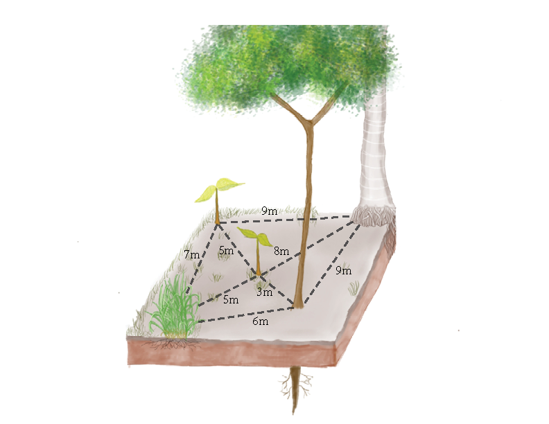

```{r eval=T, include=FALSE, cache=TRUE, cache.path="cache/"}
#install.packages(list("rstan","ggplor2","loo","dplyr","bayesplot","rethinking","purrr","png","gridExtra","grid","knitr"))
  library(rstan)
  library(ggplot2)
  library(loo)
  library(dplyr)
  library(bayesplot)
  library(rethinking)
  library(purrr)
  library(png)
  library(gridExtra)
  library(grid)
  library(knitr)
  library(kableExtra)

 
```
# 1. Introduction
Interactions between neighboring plants impact how plants grow, survive, and reproduce. Although interactions occur at the scale of individual plants, the consequences of plant-plant interactions shape population and community structure across terrestrial ecosystems. Plants tend to do worse in single-species neighborhoods than in many-species neighborhoods [@maestre_refining_2009;@sortibran_nurses_2014], a dynamic that helps explain how plant biodiversity is maintained across ecosystems, from montane deserts [@adler_coexistence_2010] to tropical rainforests [@comita_asymmetric_2010]. Plants can also facilitate the growth and survival of their neighbors, particularly in disturbed or stressful environments where “nurse plants” promote faster ecosystem recovery [@adler_coexistence_2010]. Managing plant neighborhoods, from thinning dense stands of trees [@cescatti_silvicultural_1998;@lechuga_managing_2017] to planting species that will facilitate their neighbors [@gomez-aparicio_role_2009], is a cornerstone of forestry, restoration, and agriculture. The importance of plant-plant interactions across basic and applied ecology points to the need for statistical approaches that can quantify how plant neighborhoods impact plant demography.
<br>  
Fully accounting for neighborhood interactions requires keeping track of the distance between each pair of potential neighbors, because plants interact more with neighbors that are closer than with neighbors that are further away. As an approximation to spatially-explicit models, many studies have measured plant-plant interactions with plant density in pre-defined neighborhoods [@buckley_interactions_2001;@goldberg_density_2001;@lamanna_plant_2017]. However, aggregating plants into density indices risks missing characteristics of individual plants with likely relevance for interactions, including size, species identity, and location [@canham_analysis_2006]. Aggregating plant neighborhoods into a single density metric as input to statistical models also requires assuming fixed relationships between distance and interaction strength. In contrast to density-based approaches, spatially-explicit models for plant-plant interactions can represent individual plant traits and enable data to inform the relationship between neighbor distance and interaction strength [@bolker_ecological_2008]. Altogether, spatially-explicit models provide the flexibility and detail necessary to deepen our understanding of plant-plant interactions.





While spatial models that account for individual interactions are more biologically realistic than non-spatial models with density metrics, fitting spatially-explicit neighborhood models presents several challenges. One of these challenges is the high computational power necessary to account for pairwise interactions between neighbors. Every individual element added to a pairwise distance matrix increases the matrix size following a series of square numbers. For example, the matrix representing interactions between two neighbors has 2 rows, 2 columns and 4 matrix elements; adding a third neighbor results in a matrix with 3 rows, 3 columns and 9 matrix elements. Typical sample sizes of >100 individual plants in ecological studies result in high-dimensional pairwise matrices that require high amounts of computer memory and processing power to analyze. One solution to large pairwise matrices is to assume that neighbors far from each other do not interact, resulting in zero values for many matrix elements. Matrices rich in zeros are found in a wide range of disciplines, from  graphics manipulation to acoustics [@dokmanic_euclidean_2015], and are known as sparse matrices. Methods exist that enable efficient computation on sparse matrices [@mohr_efficient_2017;@turek_efficient_2018;@rawal_programmable_2019;@bienz_node_2019], but these computational methods are likely unfamiliar to many ecologists.
<br>   
Another challenge to fitting individual-based models for plant-plant interactions is that spatially-varying functions for interaction strength are often non-linear, including strong interactions when neighbors are close together with sharp declines in effect size when neighbors are futher apart. Non-linear functions present challenges for model fitting. Unlike linear models with a standard function form, there are a wide range of possible non-linear functions, each with their own peculiarities [@bolker_ecological_2008]. In some cases, a well-known mechanistic model for plant-plant interactions may be available [e.g. self-thinning model ;@adler_model_1996 ]. However, in most cases the most appropriate non-linear function is not known in advance, and choosing a good functional form requires careful thought and model selection. Non-linear models are also more prone to identifiability problems, meaning it is difficult to define a single solution for the equation [@pickard_inference_1987;@ogle_hierarchical_2009]. The challenges of fitting non-linear models point to the need for flexible methods for model parameterization, including diagnostic tools to assess model fit. 
<br>  
Frequentist approaches have long been used to model neighbor interactions. A pioneering model in this direction was Ribbens et al. [-@ribbens_seedling_1994], which used inverse modeling  with maximum likelihood estimation (MLE) to quantify contribution of adult trees to seedling recruitment in forest neighborhoods. Similar efforts with MLE have been applied to analyze species-specific impacts of plant neighbors in growth and survival [e.g.: @uriarte_spatially_2004]. Despite the advances in understanding plant neighborhoods that MLE has provided, assessing model convergence, propagating uncertainty, and fitting random effects can be challenging under this framework [see @fournier_ad_2012].   
<br>
Bayesian approaches present another method for fitting plant neighborhood models, including implementation of hierarchical structures [i.e.: random effects; @ogle_hierarchical_2009 and latent state variables; @caughlin_importance_2014]. Latent state variables are variables that cannot be directly observed or measured and need to be inferred from other variables that can be directly observed or measured (e.g.: competition, facilitation or detectability). Both  random effects and latent state variables [@ogle_hierarchical_2009] have a more intuitive interpretation under a Bayesian framework as they provide the uncertainty associated with the estimates [@hong_comparing_2013]. In addition, the Bayesian framework  provides a suite of tools for assessing convergence and avoiding local maxima [@gelman_inference_1992;@gelman_bayesian_2013]. Another difference between frequentist and Bayesian approaches is that Bayesian methods require priors for all parameters included in the model. If chosen carefully priors can guide the model into reasonable data generation processes, and  stabilize inference on complex and highly dimensional problems [@illian_hierarchical_2009;@gelman_prior_2017]. However, if the priors are not properly chosen, the model can provide biased estimates [@banner_use_2020].  Insights on plant neighborhood dynamics from Bayesian models include crowding effects [@schneider_quantification_2006], and interspecific trait-based differences in seed dispersal [@muller-landau_interspecific_2008].
<br>  
Many of these earlier ecological analyses used the  BUGS software (Bayesian inference Using Gibbs Sampling) family (BUGS, WinBUGS, OpenBUGS, and JAGS [Just Another Gibbs Sampler; @lv_individualism_2008;@kinlock_meta-analysis_2019]. BUGS family software provided the flexibility to parametrize neighbor interactions using a Bayesian framework. However, Gibbs Sampling can require many iterations to solve complex problems, potentially leading to long run times [@yackulic_need_2020].
<br>  
A recent advance in Bayesian inference is the Hamiltonian Monte Carlo (HMC) algorithm, which provides greater sampling efficiency for many problems relative to Gibbs Sampling [@monnahan_faster_2017].  The Stan software package provides an interface to HMC, including model assessment tools, with high value for fitting neighbor interaction models. Stan may be particularly useful for fitting complex non-linear models with correlated parameters, including many neighbor interaction models, by displaying divergent transitions that occur when the posterior is not being fully explored [@monnahan_faster_2017;@betancourt_conceptual_2017;@stan_development_team_stan_2019]. 
<br>  
The goal of this case study is to describe how to fit spatially-explicit individual neighbor models in Stan.  We will start by describing the Bayesian equation for neighbor interaction models:
<br>    

$$\ [θ_1,θ_0, z|Y]α [Y|z, θ_0][z| θ_1][ θ_0][ θ_1]\quad   Eq.1$$
<br>  
Where z represents the neighbor interaction process, which is not observable and Y is the observed data or response (e.g.: growth,survival, and/or recruitment). In this equation, we relate the neighbor interaction with the response using a model with a vector of parameters $θ_0$ that represent the physical and biological attributes of the location of the studied neighbor interactions including parameters representing uncertainty in the studied system (e.g.: measurement error). The most common physical and biological attributes ($θ_0$) in spatially explicit neighbor models are resources [e.g.: water and nutrients; @molofsky_effect_1999;@suding_species_2004] or topography [@fowler_joint_2002;@callaway_positive_2002]. Then the behavior of the neighbor interaction process is predicted with a model parametrized by a pairwise matrix of parameters $\mathbf{θ_1}$ that represent neighbor attributes (e.g.: DBH, location and species).  The model parametrized by a pairwise matrix of parameters $\mathbf{θ_1}$ is based on a kernel of neighbor interaction. The kernel describes the pattern of the ecological process in absence of any randomness or error [@bolker_ecological_2008], in this case, the effect of neighbor attributes on the strength and type of neighbor interactions (Eq2).
<br>  
$$y=\sum\limits_{j=1}^n f(x_j)\quad            Eq. 2$$  
<br>  
In Eq.2, _y_ is a plant characteristic, of a sample from the total population, that could be affected by neighbor interactions (e.g., growth), _x_ represents attributes of neighboring plants that affect _y_, _f(x)_ is the equation that represent the relationship between _y_ and _x_, and n represents the total number of neighboring plants.
<br>  
To illustrate the spatially explicit individual neighbor models, we will explore different neighbor interaction plant responses, and their conceptualization and parametrization in Stan while answering the following questions:
<br>  
	1. How can we test for problems associated with non-linearity in proposed plant neighbor interactions model equations?
	 <br>  
	2. How can we solve sparsity inefficiencies from plant neighbor interaction models in Stan?
	<br>  
A challenge when using Stan for neighbor interaction modeling is making an efficient application of pairwise matrices. Stan does not support NAs so; the effects beyond the radius are set to zero creating a sparse pairwise matrix. This can increase run time and the computational expense of neighbor models.  In this paper, we would like to show how the segment function can improve the computational time of the model. When we set the neighbor effect radius, we created a considerable amount of meaningless zeroes.  One of the ways to decrease computation time is to slice off zeros from the neighbor matrices as they do not contribute to the crowding term. The segment function requires creating a long vector of observations in which we eliminated all zeroes. Then we will create a vector indicating the position of the first matrix row value and others that indicates the amount of non-zero values on each matrix row (Fig. 2).
<br>


<br>    
3. How to solve convergence problems when using random effects in Stan?
<br>  
When the data in the model is not sufficiently informative, the correlation between the random effect parameters can become too tight and prevent the model to explore the full probability surface. When this happens, we need to use a non-centered parametrization. However, when the data is informative enough, a centered parametrization will provide a more efficient exploration of the surface [@betancourt_hamiltonian_2015]. We will explore the code and the results from both parametrizations to illustrate the costs and benefits in plant neighbothood models.
<br>  


# 2. Simulation: Effect of neighbor plants on growth  
We start by simulating a spatially explicit data set of plant growth and then fitting a neighborhood model. We will use a simulation ensure that both, the code for the full matrix and the segment function are capable of recovering the generating values of the parameters. As an example, we model the growth of stationary plants as a function of their intrinsic growth (growth in isolation) and that of their neighbors (i.e., neighbor size and proximity; Eq. 3).  

$$\ growth\sim normal(\mu,\sigma ^2)\\ 
\ \mu_i = \alpha + \beta s_0 + a_3 \sum\limits_{i=1}^n \frac {size_{i}^{a_1}} {distance_{i}^2 a_2} \quad            Eq. 3 $$

Where _“α”_ is the intercept, _“β”_ is the growth rate of plants depending on their initial size, “$\mathit{s_0}$”  is the initial size of the target plant, size, and distance are the matrix containing the size and distance of neighbors,  and “$\mathit{a_1}$”, ““$\mathit{a2}$” and “$\mathit{a3}$” are parameters describing the relationship between growth, and size and distance with the neighbors. 

## 2.1 Data simulation

In this case, we can use a normal distribution to model growth, which assumes that growth could be both positive and negative (a reduction in size). The generative model will include two predictor variables: the size of plants at time t and t+1, and a spatial component: the x and y coordinates for each individual:
```{r, cache=TRUE, cache.path="cache/"}
N=500
size_t0=rnorm(N,mean=10, sd=1)
size_t1=rnorm(N, mean=35,sd=1)
```

and a spatial component: the _x_ and _y_ coordinates for each individual:  
```{r, cache=TRUE, cache.path="cache/"}
x=runif(N,min=0,max=60)
y=runif(N,min=0,max=60)
distmat=as.matrix(dist(cbind(x,y),method="euclidean"))
```

The pairwise matrix represented by “distmat” can become large, so one solution is to assume that neighbors far from each other do not interact. This is done by establishing a neighbor effect radius, which is a common practice in neighbor interaction analyses bearing biological and practical motivations. The consequence of establishing a neighbor effect radius is that the effect of all individuals beyond the radius threshold is disregarded. Biologically, we assume that neighbor effect becomes negligible beyond a certain distance based on the investigated biological mechanism. Practically, it decreases the cost of field data collection and computational time since we need data of fewer individuals. Selecting a good threshold can be based on ecological knowledge [@palmer_influence_2017], by testing at which neighbor effect radius the model has the best fit [@pacala_neighborhood_1985;@pacala_neighborhood_1987], or a mix of both. Another way of finding the neighbor radius threshold is including the radius in the model as a parameter and letting the model to estimate it [@uriarte_spatially_2004]. On the other hand, defining a neighbor effect radius can be complicated for clonal plants, as they are hard to identify as individuals. Also, in long term studies researchers should take into account that plants can change their neighbor effect radius as they grow in size [@dieckmann_neighborhood_2000].
<br>  
In this example we created 6 different neighbor effect radiuses between 0 and a 100m to compare the segment function with the full matrix under different data sizes. In this way we can separate the efficiency of the segment function from the reduction in time because of smaller data size. We decided that only one of the neighbor effect radiuses will be used to create the response in the generative model. In this case, because it is a simulation the radius has been selected arbitrarily at 62 m. With real data the decision of this radius should be based on biological knowledge.  Then, we zero the effect of distant neighbors and retain the structure of the neighborhood matrix:
  
```{r, cache=TRUE, cache.path="cache/"}
NeR<-c(seq(5,100, by=19)) #Here we create the neighbor effect radius. A 100m is greater than the maximum distance, so it is equivalent to the whole data with no neighbor effects.
distmat1=ifelse(distmat>NeR[1],0,distmat) #here, the cut-off is at 5m;
distmat2=ifelse(distmat>NeR[2],0,distmat) #here, the cut-off is at 24m;
distmat3=ifelse(distmat>NeR[3],0,distmat) #here, the cut-off is at 43m;
distmat4=ifelse(distmat>NeR[4],0,distmat) #here, the cut-off is at 62m;
distmat5=ifelse(distmat>NeR[5],0,distmat) #here, the cut-off is at 81m; 

```

Because the neighbors further than the neighbor effect radius do not affect the response variable, we set also the size of them to zero.  
```{r, cache=TRUE, cache.path="cache/"}
sizemat=matrix(rep(size_t0,500),nrow=500,ncol=500,byrow=T)
sizemat1=ifelse(distmat1==0,0,sizemat)
sizemat2=ifelse(distmat2==0,0,sizemat)
sizemat3=ifelse(distmat3==0,0,sizemat)
sizemat4=ifelse(distmat4==0,0,sizemat)
sizemat5=ifelse(distmat5==0,0,sizemat) 

```

Next, we will use the simulated predictors at 62m neighbor effect radius to generate our response. As described above, the response will be a function of individual size, and a non-linear function that relates the neighbor size and distance to the focal individual. In this model, we created a relationship in which the effect of neighbors increases with their size and decreases with distance (see Eq. 3). 
 
```{r, cache=TRUE, cache.path="cache/"}
#Here, the parameters are set to produce a biologically reasonable outcome:
alpha=1.8 # Intercept.
beta=0.45 # Size dependent growth (we hypothesize that bigger individuals grow faster).
a3=-.035 # Neighbor effect parameter
a2=0.7 # Scaling parameter which determines the spatial reach of neighbor effect
a1=1.3 # Size dependent effect of the neighbor.
true_param=c(alpha,beta,a3,a2,a1,sd=0.01)
growth=rnorm(N,
               mean=alpha+
                    size_t0*beta+
                    a3*rowSums(exp(a1*log(sizemat4)-(distmat4^2*a2))),
              sd=0.01)

# Combine the predictors in the list:
case_stanlist1=list(N=N,growth=growth,size_t0=size_t0, distmat=distmat1,sizemat=sizemat1)
case_stanlist2=list(N=N,growth=growth,size_t0=size_t0, distmat=distmat2,sizemat=sizemat2)
case_stanlist3=list(N=N,growth=growth,size_t0=size_t0, distmat=distmat3,sizemat=sizemat3)
case_stanlist4=list(N=N,growth=growth,size_t0=size_t0, distmat=distmat4,sizemat=sizemat4)
case_stanlist5=list(N=N,growth=growth,size_t0=size_t0, distmat=distmat5,sizemat=sizemat5)
case_stanlist6=list(N=N,growth=growth,size_t0=size_t0, distmat=distmat,sizemat=sizemat)

# Visualize the data:
par(pty="s")
plot(x,y,bty="n", cex=growth*.5, xlab="x", ylab="y", col=rgb(0,0,1,0.5),pch=20, main="Mapped individauls")

```
<br>  _Figure 3: Map showing the simulated plant individuals and their size. The dots show where the plants are and the size of the dot is proportional to the size of the plant._
<br>  

## 2.2 Code
Once we have our data simulated, then we will create a Stan code using the same equation and distribution used to simulate the data. Non-linear neighbor models parameters are estimated on the transformed parameters block and used to estimate the predictors for the model distribution. In our case, we used the equation  _alpha+size_t0[n]x beta+a3xkernel[n]_ to calculate mu. The priors for the parameters _“alpha”_, _“beta”_, _“a1”_, _“a2”_ and, _“a3”_ are  weakly informed priors _normal(0,5)_ for regularization purposes with a standard deviation of 5 based on the scale of the model and the range in which parameters could produce a realistic change in growth. Then we will use an _exponential(1)_ distribution for _“sigma”_ to prevent the model from exploring negative values for the standard deviation. The priors used in this example are relatively vague and could be tightened if prior information is available. The following code uses the pairwise matrix:

```{r eval=F, include=T,cache=TRUE, cache.path="cache/"}
data{  
  int N;                        // number of individuals  
  vector [N] size_t0;           // size of focal plants  
  vector [N] growth;            // growth of focal plants, response  
  vector [N] sizemat[N];        // size matrix  
  vector [N] distmat[N];        // distance matrix  
}
parameters{
  real alpha;                       // Intercept  
  real beta;                        // Effect of target plant size on response  
  real sigma;                       // global SD  
  real<lower=0> a1;                 // size dependent effect of the neighbor    
  real a3;                          // net crowding effect  
  real<lower=0> a2;                 // spatial scale  
  }
transformed parameters{  
  vector[N] kernel;  
  vector[N] mu;
  vector[N] smat[N];
  vector[N] dmat[N];
  for(i in 1:N){
    for(j in 1:N){
     smat[i,j]=sizemat[i,j]^a1;
     dmat[i,j]=distmat[i,j]^2*a2;
    }}
  for(n in 1:N)
      kernel[n]=sum(smat[n]./exp(dmat[n]));
  for(n in 1:N)
      mu[n]=alpha+size_t0[n]*beta+a3*kernel[n];
}
model{
  alpha~normal(0,5);   // uninformed priors centered at zero;
  beta~normal(0,5);
  a1~normal(0,5);
  a2~normal(0,5);
  a3~normal(0,5);
  sigma~exponential(1);
  for(n in 1:N)
    growth[n] ~ normal(mu[n],sigma);
}
```

If we want to use the segment function, first we have to create the three needed vectors. The code to create these in R could be this one:

```{r eval=F, cache=TRUE, cache.path="cache/"}
# code to create the vector with no zeroes and the index vectors
list=list(case_stanlist1,case_stanlist2,case_stanlist3,case_stanlist4,case_stanlist5,case_stanlist6)
n_nb=rep(NA,list[[1]]$N)#empty vector with length N (number of rows in the matrix)
#populate the vector, number of non zero observations in each row, i.e., group size index
for (n in 1:length(list)){
for(i in 1:length(n_nb)) {
n_nb[i]=sum(list[[n]]$sizemat[i,]!=0)
}
list[[n]]$n_nb=n_nb #add to the list
}

for (n in 1:length(list)){
a=as.vector(t(list[[n]]$sizemat)) #convert size matrix to a vector, i.e. append the rows
b=as.vector(t(list[[n]]$distmat)) #convert distance matrix to a vector, i.e. append the rows
size_observations=a[a!=0] #subset non-zero observations
dist_observations=b[a!=0] #subset non-zero observations
list[[n]]$size_vector=size_observations # add them to the list
list[[n]]$dist_vector=dist_observations
}
for (n in 1:length(list)){
list[[n]]$obs=length(list[[n]]$size_vector) #total number of non-zero observations
pos=rep(NA,list[[1]]$N) # position index for each group
pos[1]=1
for(i in 2:(list[[1]]$N)){
 		pos[i]=pos[i-1]+list[[n]]$n_nb[i-1]
}
list[[n]]$pos=pos
}
case_stanlist=list

```
Then to include the segment function in the Stan code we will substitute the size and distance pairwise matrices by the segment functions _segment(size_vec, pos[n], n_nb[n])_ and _segment(dist_vec, pos[n], n_nb[n])_ respectively.

```{r eval = F, include=T, cache=TRUE, cache.path="cache/"}
data{
  int obs;                      // number of observation in the long vector
  int N;                        // number of individuals
  vector [N] size_t0;           // size of focal plants
  vector [N] growth;            // growth of focal plants, response
  int n_nb[N];
  vector [obs] size_observations;        // leng vector of neighbor sizes
  vector [obs] dist_observations;        // long vector of pairwise distances
  int pos[N];
}
transformed data{
  vector[obs] dist_vec;
    for (i in 1:obs){
        dist_vec[i]=dist_observations[i]^2; //transform one of the predictors
    }
}
parameters{
...
  }
transformed parameters{
...
  vector[obs] size_vec;
  for(i in 1:obs){
     size_vec[i]=size_observations[i]^a1;
    }
  for(n in 1:N)
      kernel[n]=sum(exp(log(segment(size_vec, pos[n], n_nb[n]))-(segment(dist_vec, pos[n], n_nb[n])*a2)));
...
}
model{
...
}
```

We run the code using the pairwise matrix and the segment function for the six neighbor effect radius and the compared the model fitting efficiency between all of them. We estimated the model fitting efficiency by dividing the elapsed time by the effective sample size (ESS). The ESS is an estimation of how much autocorrelation within chains increases the uncertainty around the results. So, the larger is the ESS the lower uncertainty there is in the results [@stan_development_team_stan_2019]. Elapsed time is the time that Stan took to make 1000 iterations. So, the larger it is the elapsed time the slowest is the model is fitted. If we divide the elapsed time by the ESS we obtain a measure of how efficient is the model in term of speed and uncertainty. Lower values represent more efficient sampling:
```{r eval = F, cache=TRUE, cache.path="cache/"}
sum(get_elapsed_time(model)[,"sample"])/sum(summary(model)$summary[,'n_eff'] * 1000)
```
The result was that segment function was more efficient than the pairwise matrix even at greater data sizes. The difference in efficiency is high, especially with larger data sets. Besides the pairwise matrix model did not converge at the neighbor effect radius of 81 and 100m (Fig4.). 
```{r echo=FALSE, message=FALSE, cache=TRUE, cache.path="cache/"}

load("matrix_eff.Rdata")
load("segment_eff.Rdata")

par(mfrow=c(1,2))
{plot(NA,ylim=c(0,1),xlim=c(1,6),xaxt = "n" ,ylab="Time/ESS",xlab="Neighbor effect radius")
axis(1, at=1:6, labels=c("5m","24m","43m","62m","81m","100m"))
lines(matrix, col="#56B4E9", lty=2,lwd=2)
lines(segment,col="#009E73",lwd=2)}
{plot(NA,xlim=c(1,6),ylim=c(0,0.015),xaxt = "n" ,ylab="Time/ESS",xlab="Neinghbor effect radius")
axis(1, at=1:6, labels=c("5m","24m","43m","62m","81m","100m"))
lines(matrix, col="#56B4E9", lty=2,lwd=2)
lines(segment,lwd=2,col="#009E73")}


```
<br>  _Figure 4: Segment function is more efficient than matrix even with increased data size. On the left both matrix and segment function efficiency at different neighbor effect radius. On the right there is a closer look to the graph._ 

Once we fit the model, we can plot the results and check if the estimated parameter intervals reproduce the values we used to simulate the data (dashed lines indicate the true values used to generate the model). We plotted the estimates from the segment function at 62m neighbor effects:

```{r echo=FALSE, message=FALSE, cache=TRUE, cache.path="cache/"}
fit_m=readRDS("simulation_fit_segment_case (2).rds")
post_mat=as.matrix(fit_m)
#mcmc_areas(post_mat,pars=c("alpha", "beta", "a1","a2", "a3", "sigma"))+
plot(fit_m, pars=c("alpha", "beta", "a1","a2", "a3", "sigma"))+
vline_at(true_param, col=rgb(0.5,0,1,.75),lty="dashed")+
vline_0(colour="gray",lty="dashed")
```
<br>  Finally, we can check common diagnostic metrics to evaluate convergence. There are no divergent transitions, and the _n_eff_, which is the ESS, and _Rhat_ values indicate no sampling problems. The closer they are to one, the more similar are the chains. If chains diverge on their results, that could mean that the surface was not fully explored by all the chains [@gelman_inference_1992].

```{r echo=FALSE, cache=TRUE, cache.path="cache/"}
check_divergences(fit_m) # number of divergences
a<-round(summary(fit_m)[]$summary[1:5,],6)
kable(a)%>%
  kable_styling( full_width = F)%>%
  column_spec(1, bold = T, border_right = T)


```

# 4. Example 1:Predicting recruitment of an invasive species based on parent tree location

Our next example applies inverse modeling to estimate spatially explicit seed dispersal of invasive strangler fig trees. The focal tree species, _Ficus microcarpa_, is native to South Asia and it is in the process of invading Florida. Like other strangler figs, _F. microcarpa_ begins its life cycle by germinating in the canopy of a host tree. Over time, the strangler fig roots grow towards the ground and may eventually harm the host by competing for nutrients and constricting the host’s stem. We constructed inverse models using spatial data on the abundance of seedling strangler figs in 30 x 30 m plots embedded in 300 m radius plots where the location and size of reproductive adult fig trees were recorded. The study design, described in Caughlin et al.[-@caughlin_urbanized_2012], resulted in fifty-two plots placed along a 250-km transect in Southwest Florida. The neighborhood model quantifies how seedling abundance declines with distance from adult trees (Eq.5) .    
$$\ recruitment \sim negative \, binomial(\mu,\phi)\\
log(\mu)=a+b\sum \limits_{i=1}^n \frac{1}{j+distance_i}CP \quad  Eq.5$$


The response variable in this example is seed dispersal, which is the number of tree recruits within the monitored plots. Because our response variable is count data, we used negative binomial distribution, parameterized in terms of a mean ( _μ_) and an overdispersion parameter( _φ_). _“a”_ is the intercept, _“b”_ is the parameter describing the relationship between recruitment and the hyperbolic effect of distance, _“j”_ is the rate of decay of the effect of distance on recruitment and _CP_ is the number of cabbage palms in the 30 x 30 m plots. The number of cabbage palms is multipled by the kernel as an offset, assuming that more cabbage palms create more opportunities for fig tree seedling recruit.
<br>  
The data are organized in a distance pairwise matrix in which the number of available places for recruitment is the number of columns, and the amount of parent trees is the number of rows. Then the distance pairwise matrix is filled with the distances between each available recruitment place and each parent tree. Then we applied the 300 m neighbor effect radius.
<br>  


## 4.1 Code

The transformed parameters code for a model using the sparse pairwise matrix is the following: 
```{r eval=F, include=T, cache=TRUE, cache.path="cache/"}
transformed parameters{
  real mu[N];
  real aa[N];
  
  for(i in 1:N) {
    aa[i] = sum(ones[i] ./(j+dist[i]));
    }
   for (n in 1:N){
      mu[n]=(a+b*aa[n])*CP[n];
   }
}
```

To use the segment function in this example, we will have to take into account that there are plots that do not have any strangler fig trees nearby, indicating of an empty neighborhood that we would like to explicitly include in the model. An empty neighborhood will show as a zero in the n_nb vector, like on the second row of the predictor matrix in figure 3. If we want to account for this zeroes we will have to indicate in the code with an _if (n_nb[n]==0){mu[n]=a;} else {_ statement that when n_nb  is zero, then there is an empty neighborhoods that is contributing to the intercept: 

```{r eval=F, include=T, cache=TRUE, cache.path="cache/"}
transformed parameters{
  real mu[N];
  real aa[N];
  
  for(i in 1:N) {
    aa[i] = sum(one[i] ./(j +segment(distrag,pos[i],n_nb[i])));
  }
  
  for (n in 1:N){
    if (n_nb[n]==0){mu[n]=a;}
    else{
      mu[n]=(a+b*aa[n])*CP[n];
    }
  }
}
```


The rest of the code is the same for both approaches. We used a weakly informed prior _normal(0,1)_ in _“a”_ , _“b”_ and _“j”_ for regularization purposes [@gelman_prior_2017] and an _exponential(1)_ distribution for _“phy”_ to prevent the model from exploring negative values for the shape parameters of the negative binomial.  


```{r eval=F,include=T, cache=TRUE, cache.path="cache/"}
data {
  int N;                        //amount of seedlings
  int K;                        //number of distances between parent trees and seedlings 
  vector [K] distrag;           //matrix of distances
  int x[N];                     //count of seedlings
  int CP[N];                    //count of cabbage palms
  int n_nb[N];                  //vector giving the amount of non zero values
  int pos [N];                  //vector giving the position of non zero values
  vector [N] one;               //vector of ones for the division
  }
  
parameters {
  real <lower=0> a;
  real <lower=0> b;
  real <lower=0> j;
  real phy;
  }

transformed parameters{
  real mu[N];
  real aa[N];
  
  for(i in 1:N) {
    aa[i] = sum(one[i] ./(j +segment(distrag,pos[i],n_nb[i])));
  }
  
  for (n in 1:N){
    if (n_nb[n]==0){mu[n]=a;}
    else{
      mu[n]=(a+b*aa[n])*CP[n];
    }
  }
}

model{
  a~normal(0,1);
  b~normal(0,1);
  j~normal(0,1);
  phy~exponential(1);
  
  for (n in 1:N){
    x[n]~neg_binomial_2(mu[n],phy);
  }
}

generated quantities{
  vector[N] log_lik;
  for(n in 1:N){
    log_lik[n] = neg_binomial_2_log_lpmf(x[n]|mu[n],phy);
  }
}

```
The results of the model using matrix and segment strategies obtain the same estimation of recruitment against parent trees distance (Fig. 6) and produce estimations comparable with the frequentist approach used on the paper  (Fig. 7).
<br>  

  

```{r echo=F, cache=TRUE, cache.path="cache/"}
load("Fig_distmodelmatrix.rds")
load("Fig_distmodel.rds")
load("dat.Rdata")
fm_pars=extract(Fig_distmodelmatrix)
fm_sg=extract(Fig_distmodel)


```


```{r echo=F, warning = FALSE,cache=TRUE, cache.path="cache/"}

color_scheme_set("brightblue")
p17<-mcmc_areas(as.matrix(Fig_distmodel),pars = c("a"),prob = 0.95)+
  ggplot2::labs(
    title = "Segment function"
  )
p18<-mcmc_areas(as.matrix(Fig_distmodel),pars = c("b"),prob = 0.95)
p19<-mcmc_areas(as.matrix(Fig_distmodel),pars = c("j"),prob = 0.95)
p20<-mcmc_areas(as.matrix(Fig_distmodel),pars = c("phy"),prob = 0.95)

color_scheme_set("orange")
p21<-mcmc_areas(as.matrix(Fig_distmodel),pars = c("a"),prob = 0.95)+
  ggplot2::labs(
    title = "Sparse matrix"
  )
p22<-mcmc_areas(as.matrix(Fig_distmodel),pars = c("b"),prob = 0.95)
p23<-mcmc_areas(as.matrix(Fig_distmodel),pars = c("j"),prob = 0.95)
p24<-mcmc_areas(as.matrix(Fig_distmodel),pars = c("phy"),prob = 0.95)
grid.arrange(p17,p18,p19,p20,p21,p22,p23,p24,nrow=2,ncol=4)
```


_Figure 6: Parameters posterior density of the model describing seed dispersal of invasive strangler fig trees_


```{r echo=F, cache=TRUE, cache.path="cache/"}

mu.link=function(x){fm_sg$a+fm_sg$b*(1/(fm_sg$j+x))}
x.seq=seq(0,300,by=0.1)
mu=sapply(x.seq,mu.link)
mu.mean <- apply( mu , 2 , mean )
mu.HPDI <- apply( mu , 2 , HPDI , prob=0.95 )
plot(NA,bty="n",type="n",xlim=c(0,300), ylim=c(0,0.35),ylab="Recruitment", xlab="Distance from parent tree", cex.lab=1.5)
legend("topright", legend=c( "Sparse matrix", "Segment function","mle4"),
       col=c( "coral", "dodgerblue2","black"), lty=c(2,1,3),lwd=2, cex=1.5, text.font=4, box.lty=0)
lines(x.seq,mu.mean,lwd=2,col="dodgerblue2")
shade(mu.HPDI,x.seq,col=col.alpha("dodgerblue2",.2))

mu.link2=function(x){fm_pars$a+fm_pars$b*(1/(fm_pars$j+x))}
mu2=sapply(x.seq,mu.link2)
mu.mean2 <- apply( mu2 , 2 , mean )
mu.HPDI2 <- apply( mu2 , 2 , HPDI , prob=0.95 )
lines(x.seq,mu.mean2,lwd=2,lty=2,col="coral")
shade(mu.HPDI2,x.seq,col=col.alpha("coral",.2))

curve(exp(-3.97694)+exp(2.245328)*(1/(exp(3.95)+x)),lwd=2,lty=3,col="black",add =T, from = 0, to=300 )


```

  
_Figure 3: Curve showing the relationship between recruitment and distance from parent tree parametrized using the sparse matrix, the segment function and the mle4 package_

We did not find any divergence for all the parameters of the models fit using the sparse matrix or the segment function. Also, the _Rhat_ for all the parameters of both models was lower than 1.1 and the ESS was over 10%. _Rhat_ is an estimate of how similar are the chains estimations from one another in Stan [@gelman_inference_1992] and divergences indicate when the model had trouble exploring the posterior distribution [@stan_development_team_stan_2019]. The following code is the one we used to obtain this metrics, however if any of this metrics, divergences, _Rhat_ or ESS was problematic the model reports it at the end of the running process.
```{r eval = F, cache=TRUE, cache.path="cache/"}
check_divergences(Fig_distmodelmatrix)
print(Fig_distmodelmatrix, pars=c("a","b","j"))
check_divergences(Fig_distmodel)
print(Fig_distmodel, pars=c("a","b","j"))
```
We also compared the efficiency of the models and obtained that the segment function was more efficient that the sparse matrix.

```{r include=T, cache=TRUE, cache.path="cache/"}
sum(get_elapsed_time(Fig_distmodelmatrix)[,"sample"])/sum(summary(Fig_distmodelmatrix)$summary[,'n_eff'] * 1000)

sum(get_elapsed_time(Fig_distmodel)[,"sample"])/sum(summary(Fig_distmodel)$summary[,'n_eff'] * 1000)


```
In the original paper, the authors used a the frequentist approach in which the assessment of the model was done by fitting the model several times to ensure robustness of the estimates in different runs and using different initial parameters to ensure no bias related to where the model starts exploring the parameters.The model fit metrics from Stan, including ESS, divergences, and _Rhat_, provide a more complete assessment of convergence that is less reliant on initial starting values. 


# 5. Example 2: Effects of removal of disperser on a tropical tree species

## 5.1 Code
Our second example uses a Bayesian hierarchical framework to estimate how conspecific trees affect seedling establishment of _Miliusa horsfieldii_ in the absence of dispersers. The predictors in this model were the amount of conspecific seedling and the size and distance from conspecific adult trees. The focal species is a canopy tree for which large mammals disperse seeds.  In this study replicated the germination mode of the paper (Eq.6). They created a seed addition experiment in 95 transect of 5 km each. Then transects were divided in 1 by 1 meters in which the germination of the seeds was measured. The neighbor effect radius was set at 10m. More information about the study design can be found in Caughlin et al.[-@caughlin_loss_2014].

$$\ germination \sim binomial(S,N) \\
logit(S)= \mu+b Con.seedlings+a \sum\limits_{i=1}^n \frac{size_i}{distance_i^ger}+e_j \quad Eq.6 \\
e_j \sim normal(0, \sigma) \\
\sigma \sim normal(0,1)$$

<br>  


The response variable in this example is survival of seedlings, which is the number of seedlings that survived from the total added seeds within the monitored plots. Because our response variable is the amount of successful germinations from the amount of planted seeds, we used binomial distribution, parameterized in terms of the amount of successful germinations (S) and the amount of trials or staring amount of seeds (N). _“μ”_ is the base line germination, _“b”_ is the decrease in seed survival as a function of neighbor density, Con. Seedlings is the amount of conspecific seedling to represent the crowding effect, _“a”_ is the parameter that represents the effect of neighbor size and distance on recruitment, _“ger”_ is the distance decay of the effect of neighbor size and distance and _“e”_ is a random plot effect, to account for non-independence between seeds in the same plot. 
<br>  
The hierarchical structure of random effects, including the random plot effect in the seed germination model, can lead to model-fitting challenges. One common challenge in fitting these models is high correlation between random effect parameters (“Neil's funnel effect”). A consequence of correlated random effect parameters is difficulty in sampling parameter space as the sample becomes stuck in the highly correlated area (the titular Neil’s funnel). When this happens, a non- centered parametrization might solve the pathology. However, if the non-centered parameterization is used but Neil's funnel does not happen, the non-centered parameterization can cause the estimated Bayesian Fraction of Missing Information to be low. This means that the energy of the momentum when exploring the probability surface is not enough to explore it properly. Usually, when the number of observations given the standard deviation is small, and the data is too sparse, it will be necessary to use a non-centered parameterization, while if the number of observations given the standard deviation is enough informative, a centered parameterization is better [@betancourt_hamiltonian_2015].  To illustrate both, in this case study we used a centered and a non-centered parameterization and compared the results for the pairwise matrix and the segment function. The differences between coding a pairwise matrix or a segment function script can be found in the case study above, so we will focus in this example in the differences between parametrizing a centered and a non-centered model.
<br>  
For a centered parameterization using the segment function, we would add the random effect directly into the model _g[n] =  (..) + e[plots[n]]_. We used a weakly informed prior _normal(0,1)_ in _“a”_ , _“b”_, _“mu”_ and _“ger”_ for regularization purposes [@gelman_prior_2017], for _“e”_ we used a _normal(0, sigma_plot)_ to center the random effects mean around zero and then let the parameters of each group be a deviation from zero. 

  
```{r eval=F, include=T, cache=TRUE, cache.path="cache/"}
data {
  int N;                        //amount of seedlings
  int K;                        //number neighbors
  int M;                        //number of random levels
  vector [K] sizeN;             //matrix of neightbor size
  vector [K] distN;             //matrix of neightbor distances
  int x[N];                     //Count of seedlings
  int seeds[N];                 //amount of seeds
  int am[N];                    //vector giving the amount of non zero values
  int pos [N];                  //vector giving the position of non zero values
  int Cseedlings [N];           //amount of conspecific seedlings
  vector[N] one ;
  int plots[N];                 //random effect of plots
  

  }
  
parameters {
  real  a;
  real  b;
  real<lower=0> ger;
  real  mu;
  real e [M];
  real sigma_plot;
  
}
transformed parameters{
real<lower=0, upper=1> s[N];
real  g[N];

for (n in 1:N){
  if (am[n]==0){g[n]=mu+ b*Cseedlings[n]+e[plots[n]];}
  else{
     g[n] =  mu + b*Cseedlings[n] + a* sum(segment(sizeN,pos[n],am[n]) ./exp(ger*log(segment(distN,pos[n],am[n])))) + e[plots[n]];
      }
}
  for (n in 1:N){
     s[n] = exp(g[n])/(one[n]+exp(g[n]));
  }
 
}
model{
  a~normal(0,1);
  b~normal(0,1);
  ger~normal(0,1);
  mu~nomal(0,1);
  e~normal(0,sigma_plot);
  sigma_plot~normal(0,1);

  for (n in 1:N){
  x[n]~binomial(seeds[n],s[n]);
  }
    
}

generated quantities{
  int log_lik[N];
  for(n in 1:N){
     log_lik[n] = binomial_rng(seeds[n],s[n]);
  }
}
```
  
If we would like to use a non-centered parameterization, we will add a few parameters for the random effect _"e"_ in the transformed parameters block. The non-centered parametrization avoids the correlation between parameters that causes Neil's funnel effect by parametrizing the random effects in a linear model. The new parameters that we created are an intercept _mu_plot_, the random effect _el[n]_, and a scaling parameter _gamma_el_. _mu_plot_ is equivalent to the mean of the random effects so we chose a prior _normal(0,1)_ to maintain it around zero. _el[n]_ are the random effect deviations from zero that follow a unit normal prior _normal(0,1)_. The trick here is that the unit normal prior causes _el[n]_ to be an orthogonal vector. As a consequence, the random effects parameters become uncorrelated and avoid the Neil's funnel effect. Because _el[n]_ provide deviations that are at a scale of one we have to multiply it by the scaling parameter _gamma_el_ to bring the parameters to the model scale.

```{r eval=F, include=T, cache=TRUE, cache.path="cache/"}
parameters {
  real mu_plot;
  real el[M];
  real gamma_el;
  real sigma_plot;
  
}
transformed parameters{
real e [M];

for (n in 1:M){
  e[n]= el[n]*gamma_el+mu_plot;
}


 
}
model{
  sigma_plot~normal(0,1);
  el~normal(0,sigma_plot);
  mu_plot~normal(0,1);
  gamma_el~normal(0,1);
  }
```
The results show that when using a centered parameterization, matrix and segment function have similar comparable parameter estimates. Non-centered parameterization, however, has resulted in estimates far from the ones obtained in the study and with wider confidence intervals. The credibility intervals come from the density distribution of the posterior. That means that credibility intervals provide the range of probable values within a given range. In Bayesian statistics, the width of the credibility interval provides an estimate of how certain we are about the model results [@makowski_bayestestr_2019]. This example illustrates how the systematic use of non-centered parameterization can lead to the opposite effect on model performance. 
```{r echo=F, cache=TRUE, cache.path="cache/"}
load("Thai_matmodelcV.rds")
load("Thai_matmodelncV.rds")
load("Thai_segmodelcV.rds")
load("Thai_segmodelnc_CV.rds")
load("SG.Rdata")
Thai_matc=extract(Thai_matmodelcV)
Thai_segc=extract(Thai_segmodelcV)
Thai_matnc=extract(Thai_matmodelncV)
Thai_segnc=extract(Thai_segmodelncV)

```


```{r echo=F, cache=TRUE, cache.path="cache/"}
par(mfrow=c(1,2))
mu.link=function(x){exp(Thai_segnc$mu + Thai_segnc$b*1 + Thai_segnc$a* (90/(x^(Thai_segnc$ger))))/(1+exp(Thai_segnc$mu + Thai_segnc$b*1 + Thai_segnc$a* (90/(x^(Thai_segnc$ger)))))}
x.seq=seq(0,25,by=0.1)
mu=sapply(x.seq,mu.link)
mu.mean <- apply( mu , 2 , mean )
mu.HPDI <- apply( mu , 2 , HPDI , prob=0.95 )
plot(NA,bty="n",type="n",xlim=c(0,25), ylim=c(0,0.12),ylab="Recruitment", xlab="Distance from parent tree", cex.lab=1.5, main="Non-Centered parametrization")
legend("topright", legend=c( "Sparse matrix", "Segment function"),
       col=c( "coral", "dodgerblue2"), lty=c(2,1),lwd=2, cex=1, text.font=4, box.lty=0)
lines(x.seq,mu.mean,lwd=2,col="dodgerblue2")
shade(mu.HPDI,x.seq,col=col.alpha("dodgerblue2",.2))


mu.link2=function(x){exp(Thai_matnc$mu + Thai_matnc$b*1 + Thai_matnc$a* (90/(x^(Thai_matnc$ger))))/(1+exp(Thai_matnc$mu + Thai_matnc$b*1 + Thai_matnc$a* (90/(x^(Thai_matnc$ger)))))}
mu2=sapply(x.seq,mu.link2)
mu.mean2 <- apply( mu2 , 2 , mean )
mu.HPDI2 <- apply( mu2 , 2 , HPDI , prob=0.95 )
lines(x.seq,mu.mean2,lwd=2,lty=2,col="coral")
shade(mu.HPDI2,x.seq,col=col.alpha("coral",.2))


mu.link=function(x){exp(Thai_segc$mu + Thai_segc$b*1 + Thai_segc$a* (90/(x^(Thai_segc$ger))))/(1+exp(Thai_segc$mu + Thai_segc$b*1 + Thai_segc$a* (90/(x^(Thai_segc$ger)))))}
x.seq=seq(0,25,by=0.1)
mu=sapply(x.seq,mu.link)
mu.mean <- apply( mu , 2 , mean )
mu.HPDI <- apply( mu , 2 , HPDI , prob=0.95 )
plot(NA,bty="n",type="n",xlim=c(0,25), ylim=c(0,0.12),ylab="Recruitment", xlab="Distance from parent tree", cex.lab=1.5, main="Centered parametrization")
legend("topright", legend=c( "Sparse matrix", "Segment function"),
       col=c( "coral", "dodgerblue2"), lty=c(2,1),lwd=2, cex=1, text.font=4, box.lty=0)
lines(x.seq,mu.mean,lwd=2,col="dodgerblue2")
shade(mu.HPDI,x.seq,col=col.alpha("dodgerblue2",.2))


mu.link2=function(x){exp(Thai_matc$mu + Thai_matc$b*1 + Thai_matc$a* (90/(x^(Thai_matc$ger))))/(1+exp(Thai_matc$mu + Thai_matc$b*1 + Thai_matc$a* (90/(x^(Thai_matc$ger)))))}
mu2=sapply(x.seq,mu.link2)
mu.mean2 <- apply( mu2 , 2 , mean )
mu.HPDI2 <- apply( mu2 , 2 , HPDI , prob=0.95 )
lines(x.seq,mu.mean2,lwd=2,lty=2,col="coral")
shade(mu.HPDI2,x.seq,col=col.alpha("coral",.2))
```
<br>  _Figure 8: Curves showing the results of parametrizing the model using the matrix or segment processing of the variable distance and using the centered and non-centered parametrization._


# 6.Final remarks
Neighbor interactions are important for plants population and community dynamics. However, implementing neighbor models presents several challenges, including large pairwise matrices for neighbor interactions and correlations between estimated parameters. Our study demonstrates how Stan provides a flexible and efficient way to fit plant neighborhood models. Stan’s segment function provides a way to efficiently handle sparse matrices while providing near-identical estimates to models with the sparse pairwise matrix as input. Stan’s model convergence metrics enable thorough investigation of model fit, including the capacity to address whether centering random effects parameters improves convergence.
<br>  
Our results suggest that Stan can provide efficient and robust neighbor interaction models estimates. The Stan segment function had greater efficiency than sparse matrices even under data sizes equivalent to a full pairwise matrix (neighbor effect radius = 100 m) and was able to recover the generative model parameters. Besides, model convergence was more stable using the segment function. So, Stan provides an efficient solution for sparse pairwise matrices typical from plant neighbor interaction models. We also explored Stan tools for results assessment of neighbor interaction models under a Bayesian framework.  We used credibility intervals as a tool for model results assessment. The equivalent for a frequentist approach are confident intervals which are more complicated to calculate, contain more assumptions and are harder to interpret [@makowski_bayestestr_2019]. Besides credibility intervals we also used the Rhat and the divergent transitions to assess our results. Lastly, we assessed the model results using the effective sample size (ESS). In the paper from our first example the authors of the paper validated the uncertainty around the model by fitting the model several times with different initial values for the parameters. This can take a lot of time for complicated models while the Bayesian framework provides tools to evaluate model uncertainty at low computational time. In the second example, the model was fit using JAGS, one of the BUGs family software. BUGs family software provide _Rhat_ and ESS, however Stan is the only one that provides divergent transitions as a metric for model assessment. So, Stan and the Bayesian framework provide tools to assess model convergence and uncertainty from which plant neighbor interactions could greatly benefit. 
<br>  
Another advantage of a Bayesian framework besides results assessment is that it allows easier implementation of random effects. In the strangler fig example we replicated the model from a frequentist approach and hence there were no random effects. However, the Bayesian framework flexibility on modeling would have allowed first, to use individual cabbage palms as replicates, and instead of assuming that more cabbage palms have a positive impact on recruitment. Second, it would have allowed controlling for the spatial variability by including plot identity as a random effect. The use of random effect in plant-plant interaction modeling is not limited to having individuals as replicates and accounting for spatial variability, random effects can help to adjust estimates for imbalanced data [e.g.: Rare vs. common plant species; @soliveres_missing_2015], to study variation [e.g:. variability in plant-plant interactions by species; @madrigal-gonzalez_complementarity_2016], and to adjust estimates for repeat sampling [e.g.: measuring growth of individual plants during several years;  @theobald_climate_2017; @mcelreath_statistical_2020]. Hence plant-plant interaction models greatly benefit from the flexibility and naturally ingrained hierarchical structures from Bayesian frameworks.
<br>  
One complication of adding random effect is that it requires using a centered or non- centered parametrization depending on how informative is the data. In our second example, the non-centered parameterization provided different estimates for the pairwise matrix, and the segment function and wider confidence intervals. The centered parametrization on the other hand provided estimates with narrower confidence intervals for the models fit using the pairwise matrix and the segment function. This is true for this particular data set, but other cases will obtain better estimates using a non-centered parametrization. Stan flexibility allows to parametrize random effects using two kinds of parametrizations to avoid pathologies like Neil's Funnel effect. Obtaining estimates with good convergence and low uncertainty will require choosing the adequate parametrization for each case and the tools for results assessment from Stan can help to decide which the best parametrization is.
<br>  
Parametrizing plant neighbor interactions requires great amount of data. Luckily, data sharing has increased the availability and diversity of databases with potential to reuse observational data to quantify neighbor interaction [@soranno_building_2015]. These data offer a diversity of species, developmental stages, and plants’ spatial configurations in different ecosystems. Individual neighbor interaction modeling can benefit from this diversity and it does not require the specific creation of experiments. Individual neighbor interaction models can be parametrized with a diverse variety of databases with spatially explicit measurement of individual plants. Some examples of these databases are common gardens [@zaiats_intraspecific_2020;@madsen_coarse_2020],  forest inventories on permanent plots [@lieberman_nearest-neighbor_2007] and potentially remote sensing. The increasing number of methods capable of obtaining inventory level metrics of forest from high resolution remote sensing images could increase the size of inventory data [@falkowski_landscape-scale_2010;@caughlin_hyperspectral_2016;@graves_tree_2016]. The data use flexibility of neighbor interaction models allows diving into more diverse topics, reuse of data and contextualize between different ecosystems.
<br>   

# 7. References

